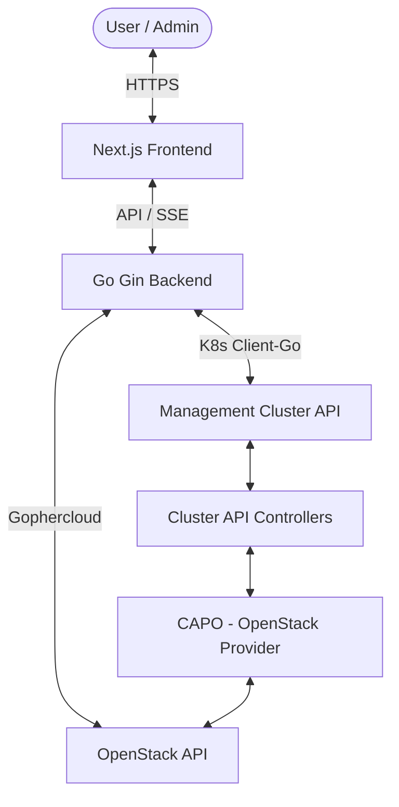

# 🚀 CAPI Dashboard (OpenStack Edition)

<div align="center">
  
  <br />
  <p align="center">
    <strong>A modern, web-based management interface for Cluster API (CAPI) on OpenStack.</strong>
  </p>

  [](https://github.com/devops-autotools/devops-project-capi-dash/commits/main)
  [](https://github.com/devops-autotools/devops-project-capi-dash/commits/main)
  [](https://go.dev/)
  [](https://nextjs.org/)
  [](LICENSE)
</div>

---

## 📖 Overview

The **CAPI Dashboard** is a streamlined administrative platform designed to simplify the lifecycle management of Kubernetes workload clusters on OpenStack infrastructure via **Cluster API (CAPI)**. 

By abstracting away complex YAML-based workflows, it empowers platform engineers and cloud architects to provision, monitor, and scale infrastructure through an intuitive and responsive user interface.

## ✨ Key Features

- 🖥️ **Centralized Dashboard:** Real-time health monitoring of all managed clusters across namespaces.
- ⚡ **Rapid Provisioning:** Intuitive form-based cluster creation with automatic OpenStack template rendering.
- 🛠️ **Infrastructure Management:** Direct visibility into OpenStack resources (Flavors, Images, Networks, Security Groups).
- 💓 **Machine Health Check:** Granular view of individual Nodes, Machines, and MachineDeployments with real-time status icons.
- 📜 **Log Streaming:** Integrated Terminal UI for real-time log viewing of controller pods via SSE (Server-Sent Events).
- 🔒 **Cloud Credentials:** Securely manage `clouds.yaml` and CA certificates directly through the UI.
- 🔄 **Real-time Updates:** Powered by Kubernetes Watchers and SSE for instant status reconciliation.

## 🛠️ Technology Stack

| Layer | Technologies |
| :--- | :--- |
| **Backend** |    |
| **Frontend** |     |
| **Cloud/Infra** |    |
| **API/Comm** |   |

## 🏗️ Architecture



## 🚀 Quick Start

### 1. Prerequisites
- A functional Kubernetes Management Cluster.
- **Cluster API (CAPI)** & **OpenStack Provider (CAPO)** installed.
- `kubectl` with admin access to the management cluster.

### 2. Deployment
Apply the RBAC and Deployment manifests:

```bash
# Create namespace
kubectl create namespace capi-system --dry-run=client -o yaml | kubectl apply -f -

# Apply RBAC permissions
kubectl apply -f deployments/rbac.yaml

# Deploy the dashboard
kubectl apply -f deployments/deployment.yaml
```

### 3. Accessing the Dashboard
The service is exposed via **NodePort 30000** by default:
- **URL:** `http://<NODE_IP>:30000`

## 💻 Local Development

1. **Clone the repository:**
   ```bash
   git clone https://github.com/devops-autotools/devops-project-capi-dash.git
   cd devops-project-capi-dash
   ```

2. **Run Backend (Port 8080):**
   ```bash
   go run cmd/dashboard/main.go
   ```

3. **Run Frontend (Port 3000):**
   ```bash
   cd web
   npm install
   npm run dev
   ```

## 📂 Project Structure

- `cmd/`: Application entry point.
- `internal/`: Core business logic (Clean Architecture).
  - `controller/`: HTTP handlers.
  - `service/`: Domain services & orchestration.
  - `repository/`: Data access (K8s, OpenStack).
  - `engine/`: Template rendering logic.
- `web/`: Next.js frontend application.
- `deployments/`: Kubernetes manifests (RBAC, Deployment).
- `docs/`: Technical documentation.

## 🗺️ Roadmap

- [ ] **RBAC & Auth:** Integration with OIDC (Keycloak/Dex).
- [ ] **Helm Chart:** Production-ready Helm chart for easier deployment.
- [ ] **Multi-Provider Support:** Future extensions for AWS/Azure.
- [ ] **Cost Estimation:** Integration with OpenStack quotas/pricing.

## 🤝 Contributing

Contributions are welcome! Please read [CONTRIBUTING.md](CONTRIBUTING.md) (if available) for details on our code of conduct and the process for submitting pull requests.

## 📄 License

This project is licensed under the MIT License - see the [LICENSE](LICENSE) file for details.

---
<div align="center">
  Developed with ❤️ by the DevOps Autotools Team.
</div>
