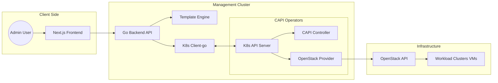

# System Architecture

## 1. Thành phần hệ thống (System Components)

### 1.1 Frontend (Next.js + Tailwind + Shadcn UI)
*   **Vai trò:** Giao diện người dùng.
*   **Công nghệ:** React/Next.js giúp tạo SPA mượt mà, Shadcn UI cho các component form chuyên nghiệp.
*   **Giao tiếp:** Gọi REST API tới Backend qua `/api/v1/*`.

### 1.2 Backend (Go + Gin/Echo)
*   **Template Engine:** Xử lý render các file `.yaml.tmpl` nằm trong `internal/assets/templates/`.
*   **K8s Client:** Sử dụng `client-go` để tương tác trực tiếp với Management Cluster.
*   **Watcher Logic:** Theo dõi sự thay đổi trạng thái của các CRDs (Cluster, Machine, ControlPlane) để cập nhật UI thời gian thực.

### 1.3 Infrastructure (OpenStack + CAPI Providers)
*   Dự án dựa trên giả định rằng Management Cluster đã được cài đặt sẵn:
    *   `clusterctl` (CAPI Core)
    *   `cluster-api-provider-openstack` (CAPO)

## 2. Luồng dữ liệu (Data Flow)

### 2.1 Luồng tạo Cluster
1.  **User:** Điền Form trên UI (Tên cụm, số lượng node, Network ID...).
2.  **Frontend:** Gửi JSON payload tới Backend.
3.  **Backend:** 
    *   Validate dữ liệu.
    *   Mapping dữ liệu vào biến template.
    *   Render chuỗi 8 file YAML theo thứ tự logic.
    *   Gọi K8s API để `Apply` (Create/Update) các resources này.
4.  **CAPI/CAPO:** Tự động bắt sự kiện (reconcile) và gọi OpenStack API để tạo VM, Network, LoadBalancer.

### 2.2 Luồng theo dõi trạng thái
1.  **Backend:** Chạy các Goroutines để Watch các tài nguyên CAPI.
2.  **API:** Trả về trạng thái tổng hợp (Ready, Provisioning, Error) cho Frontend.

## 3. Sơ đồ kiến trúc (Mermaid)

